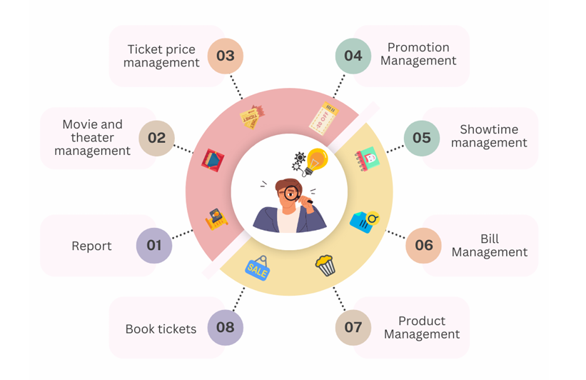

# B&Q CINEMA

## 📝 Project Overview
- Start date: 01/10/2024
- Requirement: a comprehensive cinema management system that handles end-to-end theater operations, including movie scheduling, ticket booking, seat selection, promotions management, concession sales, and refund processing.
- Live Demo: [https://www.bqcinema.xyz](https://www.bqcinema.xyz/admin)

## 🎯 Core Features

  

## 🔧 Technologies
- **Frontend**
  - Next.js (React Framework)
  - TypeScript
  - TailwindCSS
  - React Context (State Management)
- **API & Authentication**
  - RESTful API integration
  - JWT Authentication
- **Development Tools**
  - ESLint
  - Prettier
  - Git

## 📱 Screenshots & Demo

Click to expand

### Admin Dashboard

### Booking Flow

### Movie Management

### Show Time Management

### Product Management

## INSTRUCTIONS
URL `http://localhost:3000/`